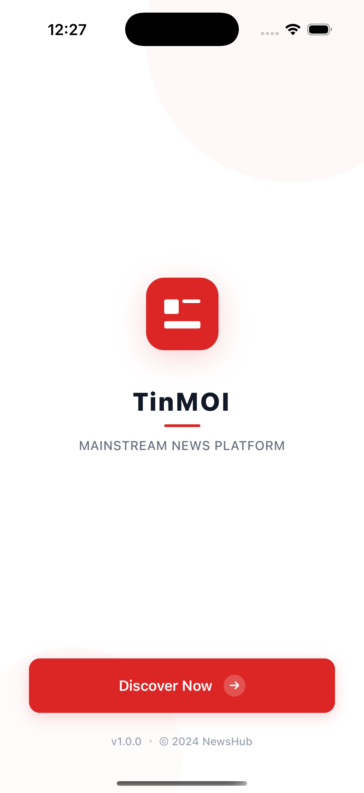

# NewsApp

NewsApp is a modern mobile application built with React Native and TypeScript that delivers up-to-date news content from various sources. It is designed with a clean UI, smooth navigation, and efficient state management to provide a fast and seamless user experience.
##



## Features

- Browse top headlines and breaking news
- View news by categories (e.g. business, technology, health, sports)
- Search for specific news articles
- Read full articles with clean formatting
- Dark mode support
- Pull-to-refresh functionality
- Responsive design for both iOS and Android

## Tech Stack

- **React Native** – for building cross-platform mobile apps
- **TypeScript** – for type safety and better code maintainability
- **React Navigation** – for screen transitions and navigation
- **Axios** – for making HTTP requests
- **Context API / Custom Hooks** – for state and logic management
- **News API** – for fetching news data
- **Expo** – for faster development and deployment


## Getting Started

### Prerequisites

- Node.js (>= 14)
- Expo CLI (`npm install -g expo-cli`)
- A News API key from [https://newsapi.org](https://newsapi.org)

### Installation

1. Clone the repository:

```
   git clone https://github.com/thanhhbao/NewsApp.git
   cd NewsApp
```
2. Install dependencies:
```
npm install
```
3. Add your News API key in a .env file:
```
NEWS_API_KEY=your_api_key_here
```

4. Start the development server:
```
expo start
```

Use the Expo Go app on your phone or an emulator to run the app.
